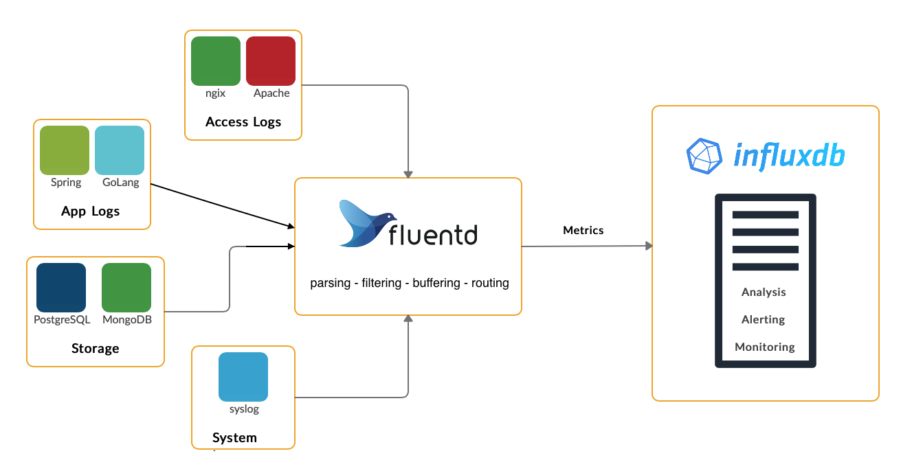
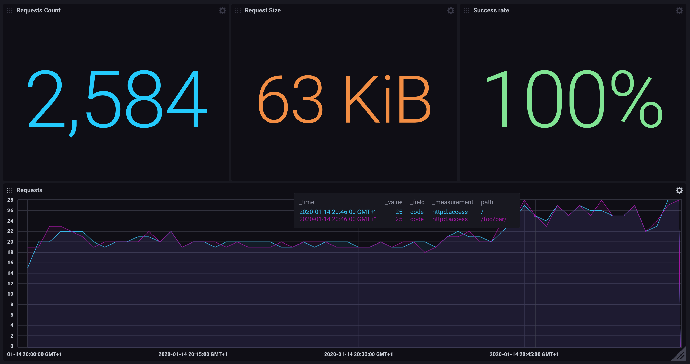

# InfluxDB 2 + Fluentd

InfluxDB 2 and Fluentd together are able to collect large amount of logs and transform it to useful metrics. 
InfluxDB 2 provide a solution for realtime analysis and alerting over collected metrics.



## Introduction

[Fluentd](https://www.fluentd.org/architecture) is an open source data collector, which lets you unify the data collection and consumption for a better use and understanding of data.

[InfluxDB](https://www.influxdata.com) open source time series database, purpose-built by InfluxData for monitoring metrics and events, provides real-time visibility into stacks, sensors, and systems. 

## Demo

The following demo show how to analyze logs (Apache Access Log) from dockerized environment.

> The steps from 1 to 6 could be skipped if you use a script:
>
> [`run-example.sh`](run-example.sh)
### Prerequisites

- Docker installed on your computer

### Step 1 — Create Docker Network

Create bridge network that allows smoothly communication between containers:

```bash
docker network create -d bridge influx_network --subnet 192.168.0.0/24 --gateway 192.168.0.1
```

### Step 2 — Start InfluxDB

Start latest `InfluxDB 2`:

```bash
docker run \
       --detach \
       --env INFLUXD_HTTP_BIND_ADDRESS=:8086 \
       --name influxdb_v2 \
       --network influx_network \
       --publish 8086:8086 \
       quay.io/influxdb/influxdb:v2.0.4
```

Create default organization, user and bucket:
```bash
curl -i -X POST http://localhost:8086/api/v2/setup -H 'accept: application/json' \
    -d '{
            "username": "my-user",
            "password": "my-password",
            "org": "my-org",
            "bucket": "my-bucket",
            "token": "my-token"
        }'
```

### Step 3 — Prepare Fluentd Docker
We have to prepare a docker image that will contains Fluentd with configured [InfluxDB 2 output plugin](https://github.com/influxdata/influxdb-plugin-fluent/).

Fluentd is configured to parse incoming events with tag `httpd.access` by regexp: `/^(?<host>[^ ]*) [^ ]* (?<user>[^ ]*) \[(?<time>[^\]]*)\] "(?<method>\S+)(?: +(?<path>[^ ]*) +\S*)?" (?<code>[^ ]*) (?<size>[^ ]*)$/` to structured event with: `time`, `host`, `user`, `method`, `code` and `size`.
These structured events are routed to InfluxDB 2 output plugin. 
#### Required files:

##### Dockerfile

```dockerfile
FROM fluent/fluentd:edge-debian

USER root

RUN fluent-gem install fluent-plugin-influxdb-v2

COPY ./fluent.conf /fluentd/etc/
COPY entrypoint.sh /bin/

USER fluent
```

##### fluent.conf

```xml
<source>
  @type forward
  port 24224
  bind 0.0.0.0
</source>
<source>
  @type monitor_agent
  bind 0.0.0.0
  port 24220
</source>
<filter httpd.access>
  @type parser
  key_name log
  <parse>
    @type regexp
    expression /^(?<host>[^ ]*) [^ ]* (?<user>[^ ]*) \[(?<time>[^\]]*)\] "(?<method>\S+)(?: +(?<path>[^ ]*) +\S*)?" (?<code>[^ ]*) (?<size>[^ ]*)$/
    time_format %d/%b/%Y:%H:%M:%S %z
  </parse>
</filter>
<match httpd.access>
  @type copy
  <store>
    @type influxdb2
    url http://influxdb_v2:8086
    token my-token
    bucket my-bucket
    org my-org
    use_ssl false
    time_precision s
    tag_keys ["method", "host", "path"]
    <buffer tag>
      @type memory
      flush_interval 5
    </buffer>
  </store>
</match>
```
Build image: 

```bash
docker build -t fluentd_influx .
```
### Step 4 — Start Fluentd image

```bash
docker run \
       --detach \
       --name fluentd_influx \
       --network influx_network \
       --publish 24224:24224 \
       --publish 24220:24220 \
       fluentd_influx
```

### Step 5 — Start Apache HTTP Server

Docker includes multiple logging mechanisms to help you get information from running containers and services.

We will use [Fluentd](https://docs.docker.com/config/containers/logging/fluentd/) logging driver with configured tag as `httpd.access`:
 
```bash
docker run \
       --detach \
       --name web \
       --network influx_network \
       --publish 8080:80 \
       --log-driver fluentd \
       --log-opt tag=httpd.access \
       httpd
```

### Step 6 — Generate httpd Access Logs

Generate some access logs by curl:
```bash
curl http://localhost:8080/
curl http://localhost:8080/not_exists
```

### Step 7 — Import Dashboard

Open [InfluxDB](http://localhost:8086) and import dashboard [web_app_access.json](influxdb/web_app_access.json) by following steps:

```
username: my-user
password: my-password
```

1. Click the **Dashboards** icon in the navigation bar.
1. Click the **Create Dashboard** menu in the upper right and select **Import Dashboard**.
1. Select **Upload File** to drag-and-drop or select a **web_app_access.json**.
1. Click **Import JSON** as Dashboard.

The imported dashboard should look like this:



 
## Conclusion

Analyze Apache Access Log is just one way how to use a power of InfluxDB and Fluentd. 
There are other things you could do with InfluxDB and Fluentd such as: [Monitoring and alerting](https://v2.docs.influxdata.com/v2.0/monitor-alert/#manage-your-monitoring-and-alerting-pipeline). 

## Links

- https://www.digitalocean.com/community/tutorials/how-to-centralize-your-docker-logs-with-fluentd-and-elasticsearch-on-ubuntu-16-04
- https://stackoverflow.com/questions/58563760/docker-compose-pulls-an-two-images-an-app-and-fluentd-but-no-logs-are-sent-to-s
- https://docs.fluentd.org/v/0.12/container-deployment/docker-compose